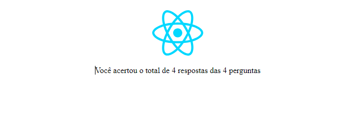

# React 
## Questionario feito com REACT usando o vite

Imagens do projeto completo.
Nesse projeto foi usado o componente Radio que foi adicionado no App. O componente recebia os valores através das props e a partir dela era realizado o consumo nas propriedades do Radio.
Além do uso tambén do hook de useState.

Você pode verificar as imagens da conclusão do projeto abaixo :

O questionario está disponível para visualização através do [link](https://react-form-lovat.vercel.app/?to=/placeholder.com)  
